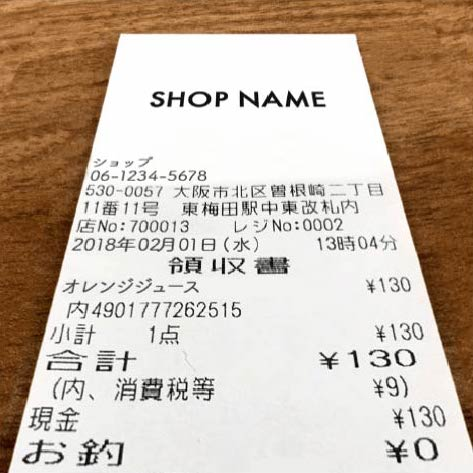
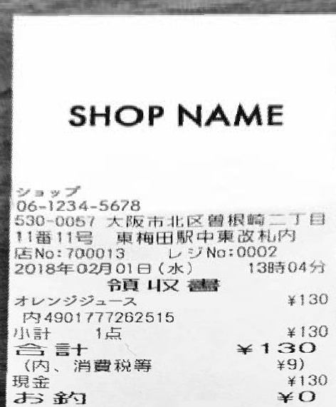

# rust_image_scan

## デモ

**処理前**



**処理後**



## Setup
### OCR
```shell
brew install wget tesseract
wget https://github.com/tesseract-ocr/tessdata/raw/4.00/jpn.traineddata 
mv jpn.traineddata /opt/homebrew/Cellar/tesseract/5.2.0/share/tessdata    
```